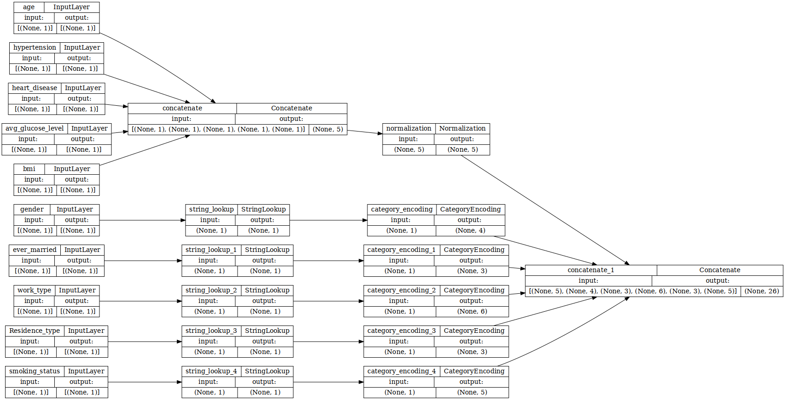
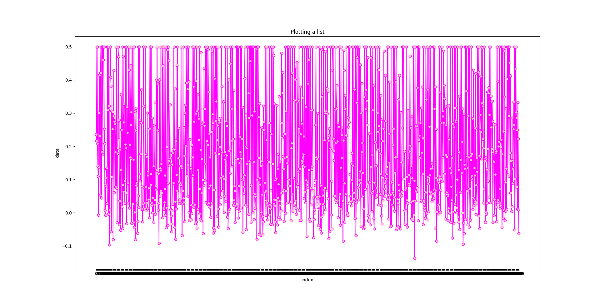

# CodeML 2022 Project 


This is the project repo for CodeML 2022. To begin collaborating simply create a new folder and run the following command in terminal:
```
git clone https://github.com/eli0009/CodeML_project .
```

## Team Members
- Enlai Li
- Eric Huang
- Younes Lazzali
- Swagat Bhowmik

## Model

This is what our model looks like:


These are the predictions of our model for 1251 entries:

